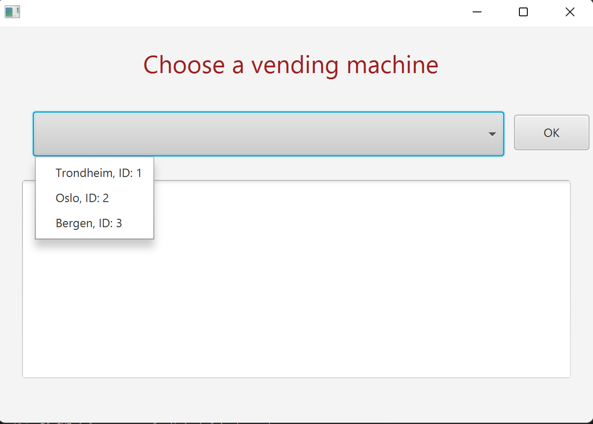

# Release 1 

Vi har i denne iterasjonen jobbet ut ifra [brukerhistorie US-1](/docs/Brukerhistorier.md).

Se [arbeidsflyt](/docs/release1/Arbeidsflyt_1.md) for å lese om hvordan arbeidsflyten i gruppen har vært med tanke på arbeidsvaner, metodikk og kodekvalitet.

### Hva er nytt i denne releasen?

- Lesing/skriving til én fil i JSON-format
- Grafisk brukergrensesnitt til et VendingMachineTracker-objekt (selve oversikten)
  - Dropdown-meny med bedriftens brusautomater
  - Kunne trykke seg inn på hver enkelt brusautomat for å se varebeholdning
- Enkel kjernelogikk

 

[Skjermbilde:](/docs/release1/skjermbildeApp.png)

[Klassediagram:](/docs/release1/Klassediagram.png)

