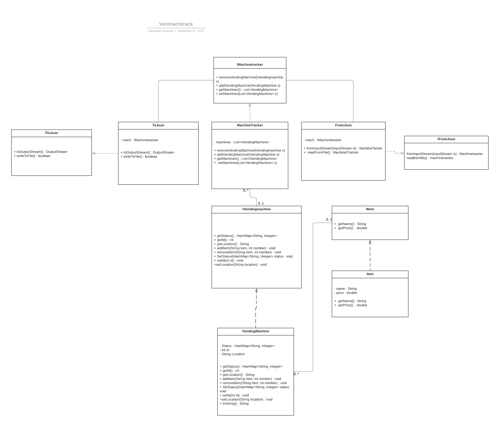

# Hva er applikasjonen ment til å gjøre?

Vendmachtrack er en applikasjon som er ment for å hjelpe eiere av flere brusautomater holde oversikt og analysere deres brusautomatbedrift.

- [Skjermbilde av appen](../docs/release1/skjermbildeApp.png) 

- [Klassediagram](../docs/release1/Klassediagram.png)

- [Brukerhistorie](../docs/Brukerhistorier.md)

 

På brukergrensesnittet når release 2 blir lansert skal brukeren kunne:

- Få opp sin vending machine tracker
- Se en liste over alle sine brusautomater vha. en dropdownmeny
- Se inventar på hver brusautomat

 

Annen funksjonalitet:

- Lagring/henting av data fra fil vha. json