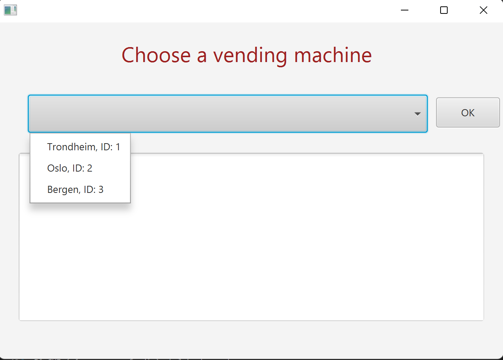

# Vending Machine Tracker (Vendmachtrack)

Vending Machine Tracker er en applikasjon for å hjelpe bedrifter holde oversikt over sine brusautomater. Brukere av applikasjonen skal kunne se informasjon slik som varebeholdning på de ulike automatene.

En brusautomat oppdaterer i utgangspunktet sin varebeholdning ved hjelp av eksterne tjenester som ikke er implementert i denne applikasjonen, for eksempel:
- Kortterminal som håndterer salg av varer (trekker fra antall i varebeholdningen)
- Påfylling av varer (legger til antall i varebeholdningen)

Likevel er det behov for at en bruker av applikasjonen selv kan oppdatere varebeholdningen uten å måtte bruke eksterne tjenester.

Applikasjonen vil lytte til endringer i filen og oppdatere brukergrensesnittet dersom det kommer endringer. Brukergrensesnittet vil også ha muligheten til å endre varebeholdningen og dermed filen. De eksterne tjenestene vil lytte til filen dersom den skulle bli endret av brukergrensesnittet til applikasjonen.

Se [brukerhistorier](/docs/Brukerhistorier.md) for konkrete scenarier.

## Funksjonalitet ved ferdig applikasjon

Brukeren skal kunne:

- Se en oversikt over sine brusautomater
- Trykke seg inn på en enkelt brusautomat og se informasjon om denne:
  - Hvor brusautomaten er plassert
  - Hvor mye av hver vare som er igjen i brusautomaten
- Oppdatere varebeholdning
- Hente oversikt fra skytjeneste og fil
- Lagre oversikt til skytjeneste og fil

 

Skjermbilde av applikasjonen pr. release 1:

- [Diagram i PlantUML](../docs/diagrams/ClassDiagram.wsd)
